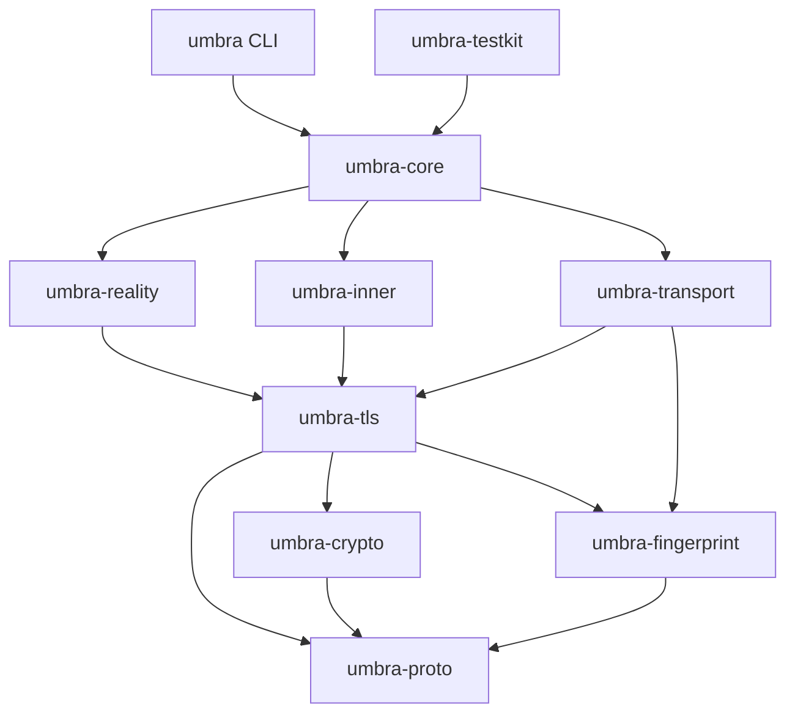

# Umbra 架构（monorepo）

本文把 `docs/protocol-design.md` 的组件（A–K）落到 Cargo workspace 的 crate 划分与 OpenSpec 能力上。
是“规划”文档；**实现须先经已批准的 OpenSpec 变更**（见根 `AGENTS.md` 的 SDD 工作流）。

## 目录结构
```
umbra/
├── Cargo.toml              # workspace（成员、依赖 catalog、全局 lint、profile）
├── rust-toolchain.toml     # 固定 1.96.1 + rustfmt/clippy/llvm-tools
├── rustfmt.toml clippy.toml deny.toml
├── .cargo/config.toml      # cargo xtask 别名
├── .config/nextest.toml    # 测试运行器配置
├── .github/
│   ├── workflows/ci.yml     # fmt+clippy / nextest / 覆盖率≥90% / deny / openspec validate
│   ├── prompts/opsx-*.md     # OpenSpec 斜杠命令（Copilot）
│   └── skills/               # OpenSpec 工作流 skill + 本项目 skill
├── openspec/                # SDD 引擎：config.yaml + changes/ + specs/
├── docs/                    # protocol-design.md（规范）+ architecture.md（本文）
├── crates/                  # 各库 crate + umbra CLI
├── xtask/                   # 开发/CI 任务运行器
└── fuzz/                    # cargo-fuzz（独立 workspace，需 nightly）
```

## crate 职责与组件映射
| crate | 职责 | 设计组件 |
|---|---|---|
| `umbra-proto` | 线格式类型、常量（OID/标签）、错误 | 基础层 |
| `umbra-crypto` | X25519/ML-KEM/ML-DSA/HKDF/HMAC/AEAD/常量时间/zeroize | I、§5/§15 |
| `umbra-tls` | 自研极简 TLS 1.3 栈（Rust 版 uTLS）：ClientHello/密钥调度/记录/客户端&服务端 | A |
| `umbra-fingerprint` | Chrome 指纹档案 + JA3/JA4 自检 | J |
| `umbra-reality` | REALITY 认证 + 证书伪造 + dest 预构建 | B、D、E |
| `umbra-inner` | mux + 自适应填充 + Vision 拼接 + 目标寻址 + 爬虫 | F |
| `umbra-transport` | TCP / QUIC(HTTP-3) / Geneva 分段抗 RST | G、H |
| `umbra-core` | 配置、服务端分派、SOCKS5、中继、会话编排 | C、K、§10/§16 |
| `umbra` | CLI（server/client/keygen） | §16/§17 |
| `umbra-testkit` | 回环 harness、可控 dest、测试向量（dev） | 测试基建 |
| `xtask` | 开发/CI 任务（coverage/ci/fuzz…） | 工程基建 |

## 依赖图（无环）


## 能力清单（OpenSpec）与建议实现顺序
按依赖顺序（非“版本路线图”，仅工程先后）。每项经 `/opsx:propose "<capability>"` 起一个变更，
产出 proposal/design/specs/tasks，`/opsx:apply` 实现，`/opsx:archive` 归档并更新 `openspec/specs/`。

| 顺序 | 能力（capability） | crate | 摘要 |
|---|---|---|---|
| 1 | `wire-proto` | umbra-proto | 地址/帧/常量/错误类型 |
| 2 | `crypto-primitives` | umbra-crypto | ECDH/KDF/MAC/AEAD/流密码 + 向量（**已建种子变更**） |
| 3 | `pq-primitives` | umbra-crypto | ML-KEM-768 / ML-DSA-65 封装（组件 I） |
| 4 | `fingerprint-profiles` | umbra-fingerprint | Chrome 档案 + JA3/JA4 自检（组件 J） |
| 5 | `tls13-utls-stack` | umbra-tls | ClientHello/密钥调度/记录/客户端&服务端（组件 A） |
| 6 | `reality-auth` | umbra-reality | session_id 认证 seal/open + 反重放（组件 B） |
| 7 | `cert-forge` | umbra-reality | 伪造叶子 + cert_mac + ML-DSA 扩展（组件 E） |
| 8 | `dest-prebuild` | umbra-reality | 探测并镜像 dest 特征（组件 D） |
| 9 | `server-dispatch` | umbra-core | 读 ClientHello→认证→冒充/转发 + PrefixedStream（组件 C） |
| 10 | `inner-mux` / `inner-padding` / `inner-vision` | umbra-inner | 内层传输三件套（组件 F） |
| 11 | `transport-tcp` / `tcp-evasion` | umbra-transport | TCP 外层 + Geneva 分段（组件 G/H） |
| 12 | `transport-quic` | umbra-transport | QUIC/HTTP-3 外层（组件 G） |
| 13 | `socks-inbound` / `config` / `orchestration` | umbra-core | SOCKS5、配置、client/server 编排 |
| 14 | `probe-resistance` | umbra-core | 时序对齐/无用记录/不限速/爬虫（组件 K） |
| 15 | `cli` | umbra | server/client/keygen 子命令 |

## 测试与 harness
- 运行器：**cargo-nextest**（`.config/nextest.toml`）。
- 覆盖率：**cargo-llvm-cov**，硬性 **≥90% 行覆盖率**（CI + `cargo xtask coverage`）。
- 层次：单元（模块内）· 集成（`crates/*/tests/`，每 spec `#### Scenario` ≥1 用例）· 性质（proptest，解析/编解码）· 模糊（`fuzz/`，所有字节解析器）· 端到端（`umbra-testkit` 回环）· 向量（RFC 8448/8439/5869、FIPS 203/204）。
- 骨架示例：`crates/umbra-crypto/tests/crypto_primitives.rs`、`crates/umbra-core/tests/e2e_loopback.rs`（当前 `#[ignore]`）。

## 官网与文档 workspace

`apps/web` 是独立的 pnpm 应用，使用 React 19.2、TypeScript strict、Vite 8、TanStack Start/Router、Tailwind CSS 4.3 与 Fumadocs。根 `pnpm-workspace.yaml` 集中管理前端依赖版本，`pnpm-lock.yaml` 与 Cargo.lock 分别锁定两个生态。

官网展示页和文档共用一个应用，分别使用营销与阅读布局。公开内容来自 `docs/site/{locale}`，仅通过受检的内容清单发布。七种 URL 语言为 `zh-hans`、`zh-hant`、`en`、`fr`、`es`、`ja`、`ca`；规范地址为 `https://umbra.cat/{locale}/`，文档位于其 `docs/` 子目录。

Cloudflare Workers 执行 SSR，Static Assets 提供脚本、样式、图片与每语搜索索引。官网不运行 Rust 协议服务，不依赖数据库、不存储用户搜索。版本与平台信息在构建时从 Cargo 和发行工作流提取。前端与 Rust 独立验证行覆盖率 >=90%，网站的手动部署工作流不改变 Rust dist 工作流。

开发、内容来源、翻译、域名别名、发布与回滚见 [website-development.md](website-development.md)。对应 OpenSpec 变更为 `add-multilingual-website`。
