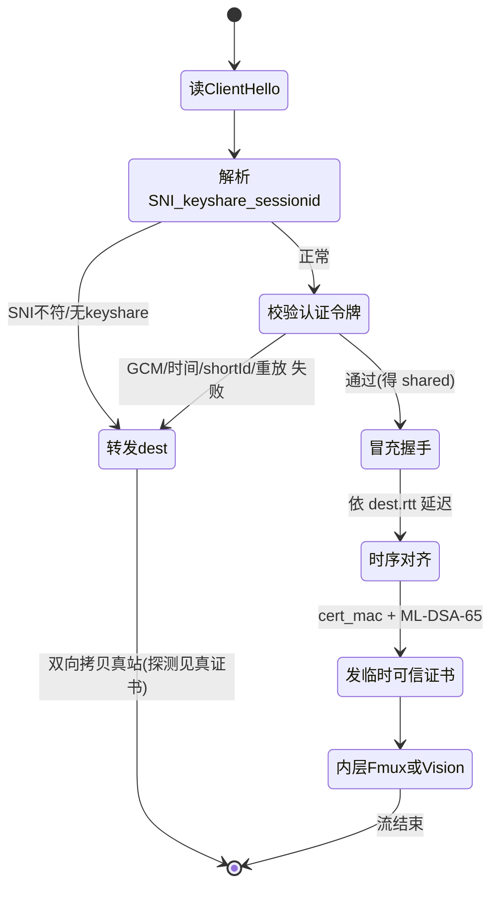
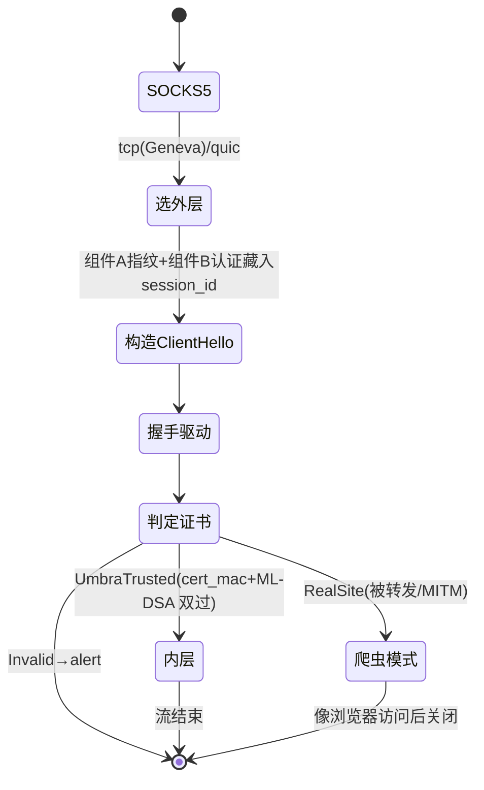

# Umbra（影）协议 — 最终技术形态与组件实现规范

> 定位：这是 Umbra 的**最终目标形态**（不是 MVP、不分阶段、无 roadmap）。全篇按**组件**拆分，
> 每个组件都是最终设计的一等公民。核心理念不变：**不靠“像噪声”隐身，而靠“本身就是一条通往真实大站的、
> 货真价实的 TLS 1.3 / QUIC 连接”隐身**；对在路观测者与主动探测者而言，Umbra 服务器就是它借用的那个真实网站。

范围：一个 client + 一个 server（不做机场/多用户面板）。语言：**Rust**。目标：**稳定翻墙、尽可能不可检测**。
本文给到**结构体/函数签名、逐字节格式、算法步骤**级别的规范（不含完整代码实现），开发照此可直接落地。

---

## 目录
- [0. 总体目标与设计定局](#0-总体目标与设计定局)
- [1. 威胁模型（GFW 检测手段）](#1-威胁模型gfw-检测手段)
- [2. 集大成与设计原则](#2-集大成与设计原则)
- [3. 总体架构（组件全景）](#3-总体架构组件全景)
- [组件 A：自研极简 TLS 1.3 栈（Rust 版 uTLS）](#组件-a自研极简-tls-13-栈rust-版-utls)
- [组件 B：REALITY 认证（复用 keyshare 的 ECDH，藏于 session_id）](#组件-brealitiy-认证复用-keyshare-的-ecdh藏于-session_id)
- [组件 C：服务端分派与探测转发](#组件-c服务端分派与探测转发)
- [组件 D：预先构建模式（dest 特征采集与镜像）](#组件-d预先构建模式dest-特征采集与镜像)
- [组件 E：冒充握手与临时可信证书（含抗量子签名）](#组件-e冒充握手与临时可信证书含抗量子签名)
- [组件 F：内层传输 —— 自适应填充多路复用 + Vision 真拼接](#组件-f内层传输--自适应填充多路复用--vision-真拼接)
- [组件 G：QUIC / HTTP-3 外层传输](#组件-gquic--http-3-外层传输)
- [组件 H：Geneva 式 TCP 分段（抗 RST 注入）](#组件-hgeneva-式-tcp-分段抗-rst-注入)
- [组件 I：抗量子（X25519MLKEM768 + ML-DSA-65）](#组件-i抗量子x25519mlkem768--ml-dsa-65)
- [组件 J：指纹管理（跟随 Chrome）](#组件-j指纹管理跟随-chrome)
- [组件 K：探测抵抗加固（时序一致 / 无用记录 / 无限速）](#组件-k探测抵抗加固时序一致--无用记录--无限速)
- [15. 密码学总表](#15-密码学总表)
- [16. 配置文件规范](#16-配置文件规范)
- [17. Rust 工程结构与模块映射（+ 函数签名）](#17-rust-工程结构与模块映射-函数签名)
- [18. 依赖清单与构建](#18-依赖清单与构建)
- [19. 测试与验证](#19-测试与验证)
- [20. 部署与运维（含 dest 选择）](#20-部署与运维含-dest-选择)
- [21. 安全与合规](#21-安全与合规)
- [附录 A：字节布局速查](#附录-a字节布局速查)
- [附录 B：状态机与数据流](#附录-b状态机与数据流)
- [附录 C：参考文献](#附录-c参考文献)

---

## 0. 总体目标与设计定局

三条已定死的架构决策，全篇据此展开：

1. **传输 = REALITY 式“借用真实身份”**：认证藏在握手（ClientHello）里，服务器在**响应前**判定；未认证/被探测
   的连接在 TCP/UDP 层**原样转发到真实借用站点 dest**，探测者只看到真站真证书。无需自有域名/证书。
2. **客户端 TLS 栈 = 自研极简 TLS 1.3（Rust 版 uTLS）**：**不依赖 BoringSSL/rustls**，完全手工构造
   ClientHello（指纹 / `legacy_session_id` / X25519 keyshare 私钥全可控），自实现 TLS 1.3 密钥调度。
   这既给出**逐字节的 Chrome 指纹**，又天然解决了“把认证写进 ClientHello 且能复用 keyshare 私钥”的最高风险点。
   服务端亦为自研极简 TLS 1.3 服务栈（用于冒充握手、伪造/镜像证书）。
3. **认证 = canonical REALITY（复用 keyshare 的 ECDH）**：`shared=X25519(C_priv,S_pub)`，认证令牌以
   AES-GCM 加密进 `session_id`，并以整条 ClientHello 为 AAD。逐连接前向保密、绑定全握手、外观随机。

内层与外层的所有增强（Vision 真拼接、预构建、mux、QUIC、Geneva、抗量子、指纹跟随）都是最终形态的组成部分，
见组件 F–K。

---

## 1. 威胁模型（GFW 检测手段）

由实测行为驱动（论文见附录 C）：

- **全加密流量熵检测（USENIX Sec 2023）**：对每条流首个数据包做实时分类，命中任一“可打印/低熵”豁免则放行。
  裸 SS/obfs4 首包高熵 → 被封。**活在真实 TLS/QUIC 里，首包是协议记录头 → 分类器不适用。**
- **主动探测（NDSS 2019/2020；GFW Report）**：主动连接可疑 IP:端口并重放/变异，看是否“像代理”。
  → **未认证连接必须表现为真网站（转发 dest）。**
- **TLS-in-TLS 指纹（USENIX Sec 2024）**：代理隧道内层 TLS 握手的记录长度/方向序列可被识别。
  → **Vision 真拼接 + 自适应填充**（组件 F）。
- **ClientHello(JA3/JA4) 指纹**：与浏览器不符即异常。→ **自研 uTLS 逐字节复刻 Chrome**（组件 A/J）。
- **SNI 检查 / ESNI-ECH 封锁**：SNI 明文可见。→ SNI=未被封的真实大站（借用 dest）。
- **有状态 TCP RST 注入（Geneva，CCS 2019）**：→ **TCP 分段/TCB 去同步**（组件 H）；或改走 **QUIC/UDP**（组件 G）。
- **重放**：→ ECDH 新鲜 keyshare + 时间戳窗口 + nonce 缓存（组件 B）。
- **残余审查**：被判定后 IP:端口临时封禁。→ 多端口/可轮换、dest 冷门 IP、QUIC 备路。
- **时序侧信道**：探测者测“到首字节 RTT”。→ 认证路径与转发路径**时序对齐**（组件 K）。

假定 GFW **不做大规模 TLS MITM 终止**（会破网且可被检测）；但设计对**逐连接 MITM**仍安全（组件 E 证书认证）。

---

## 2. 集大成与设计原则

| 原则 | 借鉴 | 摒弃的失败模式 |
|---|---|---|
| 通往真实大站的真 TLS/QUIC；未认证转发真站 | REALITY | Trojan 需自有域名+CA 证书；自签证书会被探测识破 |
| 认证藏于 ClientHello，响应前判定 | REALITY | Trojan/VMess 认证在握手后，证书已暴露 |
| 逐字节 Chrome 指纹（自研 uTLS 全控） | uTLS | rustls/通用栈指纹与浏览器不符 |
| 复用 keyshare 的 ECDH 认证，逐连接前向保密 | REALITY | 静态口令认证无前向保密 |
| Vision 真拼接消灭 TLS-in-TLS | XTLS-Vision | 裸 Trojan/VLESS 的 TLS-in-TLS 特征 |
| 自适应填充 + 多路复用降连接数关联 | anytls | 每目标一条连接的连接数特征 |
| 反重放 = 新鲜 keyshare + 时间戳 + nonce 缓存 | SS-2022 / VMess | SS(pre-2022) 可重放 |
| 抗量子（KEM + 签名） | Chrome PQC / REALITY mldsa | 纯经典密码的长期风险 |
| 单一强 AEAD、无套件协商 | SS-2022 | 降级/协商指纹 |

---

## 3. 总体架构（组件全景）

```mermaid
flowchart LR
  APP[浏览器/应用] -- SOCKS5 --> C[umbra client]
  subgraph C[umbra client]
    Cs[SOCKS5 入站] --> Cmux[内层: mux+padding / Vision solo]
    Cmux --> Ctls[组件A: 自研TLS1.3客户端\\n组件B: REALITY认证\\n组件J: Chrome指纹]
    Ctls --> Cout{组件G/H: 外层\\nTCP+Geneva 或 QUIC}
  end
  Cout == 真 TLS1.3 / QUIC，SNI=dest ==> S
  subgraph S[umbra server]
    Sdisp[组件C: 分派\\n读ClientHello→认证] -->|认证失败/探测| FWD[TCP/UDP转发]
    Sdisp -->|认证成功| Sh[组件E: 冒充握手+临时可信证书\\n组件D: 预构建镜像dest]
    Sh --> Smux[内层: mux+padding / Vision]
    Smux --> TGT[目标站]
  end
  FWD ==> DEST[dest 真实站\\n真CA证书]
```

四层职责：
1. **外层**（组件 G/H）：真 TLS 1.3 over TCP（默认，配 Geneva 抗 RST）或 QUIC/HTTP-3；SNI=借用站点 dest。
2. **握手认证层**（组件 A/B）：自研 uTLS 逐字节 Chrome 指纹，认证藏于 ClientHello 的 `session_id`+keyshare。
3. **冒充/分派层**（组件 C/D/E）：服务端响应前判定；成功则冒充 dest 完成握手并给临时可信证书，失败则转发真 dest。
4. **内层传输层**（组件 F）：mux+自适应填充（默认）或 Vision 真拼接 solo 模式；承载目标地址与数据。

---

## 组件 A：自研极简 TLS 1.3 栈（Rust 版 uTLS）

**目的**：完全掌控 ClientHello 字节与 X25519 keyshare 私钥，得到逐字节 Chrome 指纹，并支撑组件 B/E。
**范围**：仅 TLS 1.3（RFC 8446）；仅实现 Chrome 会用到的套件与扩展；客户端栈 + 服务端栈各一。不做 TLS 1.2。

### A.1 ClientHello 逐字节构造（Chrome 模板）
- 记录层：`legacy_version=0x0303`；`random`(32B, CSPRNG)；`legacy_session_id`(32B，由组件 B 填入认证令牌，
  Chrome 兼容模式本就发 32B 随机值 → **不进 JA3/JA4**)；`cipher_suites`、`compression=null`、`extensions`。
- **套件顺序**（Chrome）：`GREASE, TLS_AES_128_GCM_SHA256(0x1301), TLS_AES_256_GCM_SHA384(0x1302),
  TLS_CHACHA20_POLY1305_SHA256(0x1303)`。
- **扩展集合与顺序**（Chrome 近版，**以抓包为准、随版本更新，见组件 J**）：
  `GREASE → server_name → extended_master_secret → renegotiation_info → supported_groups
  (X25519MLKEM768,X25519,secp256r1,secp384r1) → ec_point_formats → session_ticket → ALPN(h2,http/1.1)
  → status_request → signature_algorithms → signed_certificate_timestamp → key_share(GREASE,
  X25519MLKEM768,X25519) → psk_key_exchange_modes → supported_versions(GREASE,0x0304) →
  compress_certificate(brotli) → application_settings(ALPS) → GREASE → padding`。
- **GREASE**：在套件、扩展、supported_groups、key_share、supported_versions、sig_algs 等位置按 RFC 8701
  随机注入 GREASE 值；位置/数量须与目标 Chrome 一致。
- **key_share**：包含 `X25519MLKEM768`（混合，组件 I）与经典 `X25519`。**经典 X25519 的私钥 `C_priv` 由我方
  生成并保留**（组件 B 认证复用）。
  `0x11ec` 的客户端内容严格为 `ML-KEM-768 公钥(1184) || X25519 公钥(32)`；服务端内容严格为
  `ML-KEM-768 密文(1088) || X25519 公钥(32)`，见 RFC 10024 §4。0.0.8 修正早期的相反顺序；不兼容旧错序格式。
- **padding**：把 ClientHello 补到 Chrome 习惯的长度分布（通常 512 的整数附近）。

### A.2 TLS 1.3 密钥调度与状态机（客户端）
按 RFC 8446 实现：
- 传输哈希 `Transcript-Hash`；`HKDF-Expand-Label` / `Derive-Secret`。
- `Early=HKDF-Extract(0,PSK|0)` → `Handshake=HKDF-Extract(Derive-Secret(Early,"derived",""),ECDHE)` →
  `c/s hs traffic`、`Master`、`c/s ap traffic`、`exporter`、`resumption`。
- TCP 与 QUIC 的 `c/s ap traffic`、`exp master` 使用截止 **Server Finished** 的 transcript；
  `res master` 使用截止 **Client Finished** 的 transcript，API 必须区分这两个边界。
- ClientHello 的 `compress_certificate` 使用 RFC 8879 的 uint8 算法列表长度；Brotli 算法 2 编码为
  `02 00 02`。解压须同时限制压缩和解压长度，transcript 保留原始 CompressedCertificate 消息。
- 握手消息须有界跨记录重组，并接受合法兼容 CCS；不能假定服务端固定发送两条记录。
  验证 ServerHello 版本、零压缩、session-id 回显、扩展唯一性及参数确实被 offer；不支持的 HRR 明确拒绝。
  所有广告的 TLS 1.3 可用签名算法须由成熟实现验证，TLS 1.2 专用算法不能用于 TLS 1.3 CertificateVerify。
- ECDHE：X25519（认证复用此份）+ 可选 X25519MLKEM768（组件 I 混合共享秘密）。
- 记录保护：`TLS_AES_128_GCM_SHA256` / `TLS_AES_256_GCM_SHA384` / `TLS_CHACHA20_POLY1305_SHA256`
  （RustCrypto `aes-gcm`/`chacha20poly1305`）；每方向 `key/iv` + 序号 nonce。
- 消息：ClientHello→(ServerHello, EncryptedExtensions, Certificate, CertificateVerify, Finished)→
  (Client Finished)。**兼容模式**发送一次 dummy `ChangeCipherSpec`（与 Chrome 一致）。
- 证书校验交给组件 E 的回调（区分临时可信/真/无效）。

### A.3 TLS 1.3 服务端栈（用于组件 E 冒充握手）
- 接受 PrefixedStream（组件 C 已读的 ClientHello 回放）继续握手；产出 ServerHello（镜像 dest 参数，组件 D）、
  EncryptedExtensions、Certificate（组件 E 伪造/镜像）、CertificateVerify（用伪造叶子私钥）、Finished。
- **ServerHello 的 `legacy_session_id_echo` 必须回显客户端 32B**（TLS 1.3 兼容模式要求）；密码套件、
  key_share group、ALPN 均取自组件 D 的 `DestProfile`。

### A.4 模块与签名
```rust
// tls13/clienthello.rs
pub struct ClientHelloParams { pub sni:String, pub session_id:[u8;32], pub x25519_priv:[u8;32],
    pub x25519_pub:[u8;32], pub mlkem: MlkemShare, pub profile: FingerprintProfile }
pub fn build_client_hello(p:&ClientHelloParams) -> Vec<u8>;         // 逐字节序列化（GREASE/顺序按 profile）

// tls13/handshake.rs（客户端）
pub struct Tls13Client { /* transcript, secrets, aead ... */ }
impl Tls13Client {
    pub fn start(params:ClientHelloParams) -> (Self, Vec<u8> /*ClientHello 记录*/);
    pub fn drive(&mut self, inbound:&[u8], verify:&dyn CertVerify) -> DriveOut; // 推进握手/产出待发字节/完成
    pub fn app_seal(&mut self,pt:&[u8])->Vec<u8>; pub fn app_open(&mut self,ct:&[u8])->io::Result<Vec<u8>>;
}
pub trait CertVerify { fn verify(&self, leaf_der:&[u8], chain:&[Vec<u8>]) -> PeerKind; }
pub enum PeerKind { UmbraTrusted, RealSite, Invalid }

// tls13/server.rs（服务端冒充）
pub struct Tls13Server { /* ... */ }
impl Tls13Server {
    pub fn accept(chello_raw:&[u8], leaf:ForgedCert, profile:&DestProfile) -> (Self, Vec<u8>);
    pub fn drive(&mut self, inbound:&[u8]) -> DriveOut;
    pub fn app_seal(&mut self,pt:&[u8])->Vec<u8>; pub fn app_open(&mut self,ct:&[u8])->io::Result<Vec<u8>>;
}
```

> 实现要点：优先把“ClientHello 构造 + 密钥调度 + 记录层”做扎实并用 `tls.peet.ws` / JA4 工具核对；
> 复杂的证书压缩（brotli，`compress_certificate`）在客户端只需**能解压对端**即可（Chrome 会 offer）。

---

## 组件 B：REALITY 认证（复用 keyshare 的 ECDH，藏于 session_id）

### B.1 密钥与参数
- 服务器静态 X25519 `(S_priv,S_pub)`；`S_pub` 作为客户端“公钥/口令”，**对 GFW 保密**（安全根基）。
- `short_id`：0–8 字节集合（服务端配置，客户端选其一），区分客户端。
- `max_time_diff`：默认 120s。`server_names`：允许 SNI 集；`dest`：借用站点 `host:443`。

### B.2 客户端认证载荷（逐字节，藏于 `legacy_session_id`）
复用组件 A 的经典 X25519 keyshare `(C_priv,C_pub)`：
1. `shared = X25519(C_priv, S_pub)`（32B）。
2. `auth_key = HKDF-SHA256(shared, salt="umbra-reality-v1", info="key")[..16]`（AES-128 密钥）；
   `nonce = HKDF-SHA256(shared, salt="umbra-reality-v1", info="nonce")[..12]`。
3. 明文 `P`（16B）= `ver(1)=0x01 || flags(1) || ts(u32 BE,4) || short_id(8) || reserved(2)=0`。
4. `ct||tag = AES-128-GCM-Seal(auth_key, nonce, P, aad = HELLO0)`，其中 **`HELLO0` = 整条 ClientHello
   握手消息、但把 `legacy_session_id` 的 32B 全部置零**，不含任何 TLS record header。
   同一握手消息改变 TLS 记录分片方式不得改变 AAD（绑定全握手，防跨 hello 挪用）。
5. `session_id (32B) = ct(16) || tag(16)`；写回 ClientHello 的 `legacy_session_id`（在序列化+算 transcript 前）。

### B.3 服务端校验（响应前，任一失败 → 组件 C 转发 dest）
1. 从原始 ClientHello 解析 `SNI`、经典 X25519 `C_pub`、`session_id(32B)`；构造 `HELLO0`（把 session_id 置零）。
2. `SNI ∈ server_names` 否则转发。
3. `shared = X25519(S_priv, C_pub)`；派生 `auth_key,nonce`。
4. `P = AES-128-GCM-Open(auth_key, nonce, ct=session_id[..16], tag=session_id[16..], aad=HELLO0)`；
   GCM 校验失败 → 转发。
5. 校验 `ver`、`reserved==0`、`|now-ts|≤max_time_diff`、`short_id∈` 集合和重放缓存；检查与插入必须原子完成。
   缓存保留至 `ts+max_time_diff`（含边界），不能从首次接收时只计一个时间窗；到期运算须检查溢出。
   容量满时拒绝新本地认证并转发 dest，不得驱逐仍有效的条目；清理缓存后仍须验证令牌时间戳。
6. 通过 → 认证成功，`shared` 传给组件 E。

修正 HELLO0 与 TLS 应用密钥边界后，两端须同步升级；认证失败不得重试旧的非标准 AAD 或密钥派生。

### B.4 安全性
- 只有知道 `S_pub` 者能算 `shared` → 未授权者无法伪造；`C_pub` 逐连接新鲜 → 逐连接前向保密的认证密钥；
  AAD=整条 hello → 令牌不能挪到别的 hello；时间窗+nonce 缓存 → 抗重放。
- `S_pub`/`short_id` 泄露即失守（与 REALITY 同）→ 带外安全分发、勿泄露。

---

## 组件 C：服务端分派与探测转发

**响应前**决定：冒充握手 or 原样转发。是探测抵抗的核心。

1. `read_client_hello_raw(conn)`：有界读取完整 ClientHello 的原始字节 `chello_raw`，处理跨多 TLS 记录的分片。
   分类有总期限和字节/记录上限；半个 header/body、到期、超限或 EOF 必须保留已读前缀并交给 dest 转发，不能本地早断。
   只禁止分类前的本地 TLS 响应，不禁止转发后的真实 dest 响应；QUIC 路径见组件 G。
2. 解析 `SNI, C_pub, session_id`（自研 parser 或 `tls-parser`）。
3. 组件 B 校验：
   - **成功** → `leaf = forge_cert(shared, SNI, dest_profile)`（组件 E）；`Tls13Server::accept(chello_raw, leaf, profile)`
     经 `PrefixedStream(chello_raw, conn)` 续握手 → 进入组件 F 内层。
   - **失败/SNI 不符/重放** → **转发 dest**：`d=connect(dest)`；`d.write_all(chello_raw)`；
     `copy_bidirectional(conn, d)`。探测者与真 dest 完成真握手、见真证书。
4. **不得**对转发连接限速或早断（组件 K）。可选加固：`maxUselessRecords`（拒绝 ChangeCipherSpec 洪泛）。

```rust
pub async fn dispatch(conn: Conn, cfg:&ServerCfg, prof:&DestProfile, replay:&ReplayCache) -> anyhow::Result<()>;
pub struct PrefixedStream<S>{/* 先回放 prefix 再透传 inner */}
```

---

## 组件 D：预先构建模式（dest 特征采集与镜像）

**目的**：让“冒充握手”与真 dest 尽可能一致（ServerHello 参数、证书字段、时序、OCSP）。

- 启动时必须取得一次经验证的 `DestProfile`；`prebuild=true` 另启周期刷新，`false` 仅禁止周期刷新，不允许默认假档案启动。
  首次探测失败则启动失败；周期刷新原子替换，失败保留上一份有效档案。采集内容：
  - 协商的 TLS 版本、**密码套件**、**key_share group**、**ALPN**、EncryptedExtensions 中出现的扩展；
  - 真实**叶子证书**（subject/issuer/validity/SAN/SCT）、是否 **OCSP stapling**、签名方案；
  - 从开始连接 dest 到首个 TLS 响应的间隔，不计后续 HTTP 等待（供组件 K 时序对齐）。
- DNS、连接、TLS、HTTP 元数据共用有限总期限；同步 I/O 不得阻塞 async executor，超时后仍运行的阻塞任务也占用有界并发额度。
- 组件 E 依 `DestProfile` 生成 ServerHello 与伪造叶子证书的**可见字段**（内容 TLS 1.3 已加密，主要防高级关联）。

```rust
pub struct DestProfile { pub tls_ver:u16, pub cipher:u16, pub group:u16, pub alpn:Vec<Vec<u8>>,
    pub ee_exts:Vec<u16>, pub leaf_template:CertTemplate, pub ocsp:Option<Vec<u8>>, pub rtt:Duration }
pub async fn probe_dest(dest:&str) -> anyhow::Result<DestProfile>;
```

---

## 组件 E：冒充握手与临时可信证书（含抗量子签名）

认证成功后，服务端**本地终结** TLS（不代理到 dest），呈现“临时可信证书”，客户端凭 `shared` 校验。

### E.1 伪造叶子证书
- 现场生成叶子（ephemeral key，其私钥用于 `CertificateVerify` 的合法签名）；字段镜像 `DestProfile.leaf_template`
  （CN/SAN=server_name、validity 等）。
- 内嵌**私有扩展** OID `1.3.6.1.4.1.62397.1`：
  `cert_key = HKDF-SHA256(shared, salt="umbra-cert-v1", info=session_id)`；
  `cert_mac = HMAC-SHA256(cert_key, leaf_SPKI_DER)`（32B）。
- **抗量子附加签名**（组件 I）：私有扩展 OID `...62397.2` = `ML-DSA-65_Sign(mldsa_sk, leaf_SPKI_DER)`。

### E.2 客户端证书校验（组件 A 的 `CertVerify`）
客户端已知 `shared`（保留了 `C_priv`）与自己的 `session_id`：
1. 派生 `cert_key`，校验 `cert_mac`（常量时间）**且** ML-DSA-65 验签（`mldsa_pk`）：
   两者皆过且 CertificateVerify 证明私钥持有 → **UmbraTrusted**（唯一允许代理业务的分类）；不要求伪证书具有公有 CA 签名。
2. 无有效我方绑定时，必须独立验证证书链、配置的信任根、预期域名、有效期和 CertificateVerify，全部通过才为
   **RealSite**。TCP 仅以支持的协商 HTTP 协议访问爬虫路径，不发送代理目标或业务数据；不支持的 ALPN 不发送错误格式请求。
   QUIC 的 RealSite 在本地拒绝代理建立，不发布业务密钥、连接就绪、SOCKS 成功或目标前缀，也不自动降级 TCP 或宣称 HTTP/3 爬虫。
3. 任一所需校验失败 → **Invalid** → 正常 TLS 错误路径断开。
4. 证书签名私钥、绑定密钥、流量密钥与探测 key-log 必须采用零化所有权和脱敏 Debug；配置解析的错误及嵌套原因不得保留秘密值或 TOML 源摘录。

> 抗 MITM：逐连接 MITM 不知 `S_priv` → 算不出 `shared` → 无法伪造 `cert_mac` → 被判为 RealSite/Invalid。

---

## 组件 F：内层传输 —— 自适应填充多路复用 + Vision 真拼接

握手已认证；内层负责“目标寻址 + 多路复用 + 抗 TLS-in-TLS”。**两种模式共存**，按连接选择：

- **默认：mux + 自适应填充**（借鉴 anytls）：一条 TLS 连接承载多逻辑流，降握手与“连接数关联”。
- **solo：Vision 真拼接**：单流独占一条 TLS，握手阶段填充、随后**原始直传不二次封装**，适合大吞吐/已知内层为 TLS。

### F.1 mux 帧格式（默认模式）
```
MuxFrame = ver(1) || cmd(1) || stream_id(4,BE) || len(2,BE) || payload(len)
cmd: 0x01 SYN(payload=目标地址) | 0x02 SYN_ACK | 0x03 DATA | 0x04 WINDOW_UPDATE(payload=u32增量)
     | 0x05 FIN | 0x06 RST | 0x07 PADDING(payload=随机，整帧丢弃) | 0x08 PING
目标地址(SYN.payload) = atyp(1) || addr(4|1+n|16) || port(2)   // 0x01 v4 / 0x03 域名 / 0x04 v6
```
- 每流独立**流控窗口**（初始如 256KiB，WINDOW_UPDATE 递增）；`DATA` 分块 ≤16384。
- 客户端 SOCKS5 每连接 → 一个 SYN 开流；兼容配置复用健康外层连接，服务端并发 connect 各目标，成功后才回 SYN_ACK。
- 会话持有跨取消的半帧读取状态与串行写入状态；开流/等待发送窗口不得吞掉其他事件。部分写入必须完成原帧或关闭连接，不能交错帧。
- 接收信用由有界缓存预留，只在应用实际消费后返还；排入队列不等于消费。检查窗口溢出、零增量及未知流控制帧，限制流数和总缓存。
- FIN 只关闭一个方向并排在既有 DATA 之后；RST 唤醒该流全部等待者，关闭流释放状态，不能结束其他流。
- 外层失败不能自动重放业务；后续新请求可建立替代连接。stream-zero UDP 关联保持独占外层，不与共享 CONNECT 会话混用。

### F.1a 自适应流控（0.0.9）

新客户端的 TCP CONNECT mux 默认先发送 `SETTINGS(0x0a, stream=0)`，载荷为 `UAF1` 和四个大端 u32：初始流窗口、初始连接窗口、最大流窗口、最大连接窗口。初始值分别为256 KiB和1 MiB；单流最大32 MiB，连接最大由配置控制且不超过64 MiB。首个设置帧与配置的随机填充合并为一次写入，普通业务写入的填充计数不变。旧客户端以SYN/UDP开场时保留旧流控。

`CREDIT(0x0b)` 携带两个大端u64：累计允许发送的上限、累计应用已消费的位置；stream=0表示连接合计。DATA必须同时满足流级和连接级信用，扩大授信不能冒充消费确认。`PROBE(0x0c)` / `PROBE_ACK(0x0d)` 在stream=0携带8字节nonce，用于本外层连接的RTT采样。

接收端依据实际消费与RTT增长窗口，在授信前获得进程/凭据组预算；已承诺信用不可撤回。FIN/RST按累计位置结算并保留取消安全。未认证回落和ClientHello构造不变。配置、内存口径和测量限制见[吞吐说明](performance.md)。

### F.2 自适应填充 scheme（抗 TLS-in-TLS，默认开启）
- **填充策略串**（可配置，形如 anytls 的 padding scheme）：定义“第 k 个写事件应把本次记录整形到的目标长度分布/
  附加 PADDING 帧长度”。默认对**每方向前 ~16 个记录**注入随机 `PADDING` 帧（长度取自 `[100,1400]`），并让首个
  业务帧前后夹带随机 PADDING，从而**打乱内层 TLS 握手的确定性长度/方向序列**。
- 之后按低频概率插入 PADDING（防长期统计特征）。

### F.3 Vision 真拼接（solo 模式，0.0.7）

TCP 的 `mux=false` 使用独占连接的新 Vision 实现；`mux=true` 保留加密多路复用。客户端与服务端需同时支持0.0.7。
旧的普通 solo 中继和未接入运行时的 helper 已删除，不再增加一个独立 Vision 配置开关。

1. 认证格式中的模式标识把新 solo 与 mux 区分；未认证/旧端回落不接收目标或业务控制数据。
2. 客户端先发送目标地址，再交换已认证的能力；服务端目标连接成功后才允许 SOCKS success 和业务 DATA。
3. 通过有界双向重组观察有效 TLS 1.3 ClientHello/ServerHello 及完整受保护记录；不符合条件的流量保留外层加密。
4. 客户端协调请求、确认、提交、最终确认，分别核对两方向字节边界；排空外层写入，保留读入前缀，再移交原始 TCP。
5. 原始阶段转发原内层受保护 TLS 记录，不再增加外层 TLS 加密、envelope 或 padding；保留记录结构检查和半关闭。

`0x17` 也可能承载加密握手或 alert；被动观察不能验证内层 Finished 或证明恶意模拟应用的字节确实已加密。
应用自己的端到端 TLS 仍负责目标认证和机密性。原始转发使用用户态 I/O，不声称内核零拷贝或固定性能提升。

精确线格式、上限、拒绝/提交状态、EOF/取消及向量见[已批准的 wire 规范](vision-runtime-wire-v2.md)。
真实运行时测试使用独立 rustls 端点，确认双向256 KiB业务完整、线上后缀与内层密文逐字节一致，且切换后外层seal/open计数停止。
实际Mac与服务器0.0.7线上请求也已验证拼接；详见[验收记录](../openspec/changes/integrate-vision-runtime/verification.md)。

> mux 与 raw splice 互斥；QUIC 不进入此 TCP 移交路径。没有按业务自动另建 solo 的启发式。

### F.4 模块与签名
```rust
// inner/mux.rs
pub struct MuxSession<IO>{/* streams, windows */}
impl<IO:AsyncRead+AsyncWrite> MuxSession<IO>{
  pub fn client(io:IO, pad:&PadScheme)->Self; pub fn server(io:IO, pad:&PadScheme)->Self;
  pub async fn open(&self, dst:&Addr)->Stream;   // 客户端开流(SYN)
  pub async fn accept(&self)->(Stream, Addr);      // 服务端收流
}
// inner/vision.rs
pub async fn vision_relay(tls:TlsIo, target:TcpStream) -> io::Result<()>; // 嗅探→整形→splice
// inner/padding.rs
pub struct PadScheme{/* 由配置字符串解析 */} pub fn parse_pad_scheme(s:&str)->PadScheme;
// inner/spider.rs
pub async fn spider(tls:TlsIo, spider_path:&str) -> io::Result<()>; // RealSite 时像浏览器访问后关闭
```

---

## 组件 G：QUIC / HTTP-3 外层传输

**目的**：UDP 传输更抗 RST 注入、无队头阻塞、支持 0-RTT；对外呈现 Chrome 风格 QUIC/HTTP-3，认证成功后用 QUIC stream 承载目标流。

- **握手复用组件 A 的 TLS 1.3 逻辑**：QUIC 用 TLS 1.3 作为握手（ClientHello 在 Initial 包的 CRYPTO 帧中，
  Initial 密钥由 DCID + 固定 salt 派生 → ClientHello 对 GFW 可见，与 TCP 路径同）。
  QUIC 的 `supported_versions` 仅包含 TLS 1.3 与有效 GREASE，不得照搬 TCP 档案里的 TLS 1.2；
  该派生必须在计算 HELLO0/AAD 和认证令牌之前完成，直接 QUIC TLS API 不静默改写已绑定的握手参数。
- **指纹**：复刻 **Chrome 的 QUIC 指纹**——QUIC 版本、transport parameters 集合与顺序、ALPN=`h3`、
  ClientHello 扩展（含 `quic_transport_parameters`）、SCID 长度、GREASE transport parameter（组件 J 维护）。
- **REALITY 认证载体（QUIC 与 TCP 不同）**：QUIC 的 TLS ClientHello **不使用** `legacy_session_id`（须为空）。
  故认证令牌改由 **一个 Chrome 风格的 GREASE `quic_transport_parameter`** 承载（Chrome 本就发送带随机值的
  GREASE transport parameter）：把组件 B 的 `ct||tag`(32B) 放入该 GREASE 参数值，AAD 仍为整条 ClientHello。
  ECDH 仍复用 ClientHello 的经典 X25519 keyshare。**该参数的编号/长度须与真实 Chrome 的 GREASE 参数一致，
  以抓包为准**；若 32B 过长，则拆分为 SCID(8B, 客户端可控且随机) + GREASE 参数余量。
- **服务端分派**：读 Initial 包→解出 ClientHello→组件 B 校验；失败 → 以 UDP 层把该连接**转发到真 dest 的
  QUIC** 服务（原样转发 Initial 及后续 UDP 数据报）；成功 → 本地以组件 E 完成 QUIC-TLS 冒充握手。
- 内层同组件 F（QUIC 流天然多路复用，可直接用 QUIC stream 承载各目标流，省去自研 mux；Vision 拼接在 QUIC 上
  以“stream 直传”实现）。

```rust
// transport/quic.rs
pub struct QuicFingerprint{/* versions, tparams 顺序/值, alpn=h3, grease param */}
pub async fn quic_connect(server:&str, sni:&str, auth:&[u8;32], fp:&QuicFingerprint)->anyhow::Result<QuicConn>;
pub async fn quic_dispatch(dgram_sock:UdpSocket, cfg:&ServerCfg, prof:&DestProfile)->anyhow::Result<()>;
```
> 说明：自研 QUIC 工作量大；可基于 `quiche`（BoringSSL 系，便于指纹定制）或 `quinn`（需替换 crypto provider
> 以接入组件 A 的握手与指纹）。QUIC 指纹与 REALITY-over-QUIC 载体均需以真实 Chrome 抓包核对。

---

## 组件 H：Geneva 式 TCP 分段（抗 RST 注入）

**当前支持范围**：`off` 普通发送与 `segment` 有序分次写入；不宣称已实现或实测高级 Geneva 发包策略。

- `segment` 保证拼接后的 ClientHello 字节与原文一致，不保证每次 write 对应独立 TCP 包，也不据此保证抗干扰效果。
- 没有发送实现的 Geneva DSL 必须在配置校验时明确拒绝，不能静默等同于 `off`；本次修订不引入特权原始套接字。
- 只有尚未发送任何字节的可恢复分段准备错误可以回退普通发送。部分写入后出错返回传输错误，不能从头重发导致前缀重复。
- QUIC 使用独立 UDP 路径，不把两种传输或其指纹的验证结果混为一谈。

```rust
// transport/geneva.rs
pub struct TcpEvasion{/* strategy */}
pub fn parse_strategy(s:&str)->TcpEvasion;
pub async fn write_client_hello_evasive(sock:&TcpStream, chello:&[u8], ev:&TcpEvasion)->io::Result<()>;
```

---

## 组件 I：抗量子（X25519MLKEM768 + ML-DSA-65）

- **密钥交换 PQ**：ClientHello 的 key_share 含 `X25519MLKEM768` 混合（Chrome 已默认），最终混合秘密严格为
  `ML-KEM-768 共享秘密(32) || X25519 共享秘密(32)`，按 RFC 10024 §4.3 输入 TLS 1.3 密钥调度。
  RustCrypto `ml-kem` 提供 ML-KEM-768。**REALITY 认证仍复用经典 X25519 keyshare 分量**（组件 B）。
- **证书签名 PQ**：组件 E 的临时证书附加 `ML-DSA-65` 私有扩展签名（RustCrypto `ml-dsa`）。服务端持
  `mldsa_sk`（由 `mldsa_seed` 派生），`mldsa_pk` 配置给客户端；客户端在 UmbraTrusted 判定中**同时**校验
  `cert_mac`（HMAC over shared）与 ML-DSA-65 验签，实现经典+PQ 双保险。

```rust
pub struct MlkemShare{/* encaps key(client) / ciphertext(server) */}
pub fn mlkem_keygen()->(/*ek*/Vec<u8>,/*dk*/Vec<u8>);
pub fn mldsa_keygen_from_seed(seed:&[u8;32])->(/*pk*/Vec<u8>,/*sk*/Vec<u8>);
pub fn mldsa_sign(sk:&[u8], msg:&[u8])->Vec<u8>; pub fn mldsa_verify(pk:&[u8],msg:&[u8],sig:&[u8])->bool;
```

---

## 组件 J：指纹管理（跟随 Chrome）

**目的**：自研栈不像 BoringSSL 天然=Chrome，指纹必须**数据化、可更新**。

- **指纹档案**（数据表）：编码某个目标 Chrome 版本的 ClientHello 全部可见特征——套件表、扩展集合与**顺序**、
  GREASE 位点、supported_groups、sig_algs、ALPN、ALPS、compress_certificate、key_share 组合、padding 习惯；
  QUIC 侧另编码 transport parameters 与顺序、h3、GREASE param。
- **采集/更新机制**：用真实 Chrome 抓一份 ClientHello（或用 `tls.peet.ws/api/all`、JA4 工具），解析成档案表；
  项目内置 1–2 个稳定档案并注明对应 Chrome 版本；档案与代码解耦，便于随 Chrome 升级替换。
- **一致性自检**：CI/启动时用 JA3/JA4 对比“我方 ClientHello”与“目标档案”，不一致则告警。

```rust
pub struct FingerprintProfile{/* ciphers, ext_order, grease_slots, groups, sigalgs, alpn, alps, ... */}
pub fn load_profile(name:&str)->FingerprintProfile;    // 如 "chrome-latest"
pub fn ja3_ja4(chello:&[u8])->(String,String);          // 自检用
```

---

## 组件 K：探测抵抗加固（时序一致 / 无用记录 / 无限速）

- **时序对齐**：用组件 D 的连接至首个 TLS 响应间隔，在分类决策后的本地准备时间中扣减，
  首个 ServerHello 前仅等待剩余的非负间隔；本地已经更慢时不再延迟，不保证未经测量的不可区分性。
- **无用记录检测（maxUselessRecords）**：超过分类限额即转发 dest；可配置的未认证早断动作须在启动前拒绝。
- **回落不限速、不早断**：转发 dest 的连接不施加 Umbra 特有限速或垃圾触发早断；请求半关闭仍保留返回响应。
- **爬虫模式**：TCP 客户端仅在完整证书验证后，以支持的 ALPN 协议访问 `spider_path`；QUIC RealSite 本地拒绝代理。
- **端口/IP 轮换**：多监听端口、备用 IP，降低残余审查影响；QUIC 与 TCP 双路可切换。

---

## 15. 密码学总表
- **ECDH**：X25519（`x25519-dalek`）；混合 KEM：ML-KEM-768（`ml-kem`）。
- **KDF**：HKDF-SHA256（`hkdf`+`sha2`）；标签见组件 B/E（`umbra-reality-v1` / `umbra-cert-v1`）。
- **认证令牌**：AES-128-GCM（`aes-gcm`），藏于 `session_id`，AAD=整条 ClientHello（session_id 置零）。
- **证书绑定**：HMAC-SHA256（`hmac`）+ ML-DSA-65（`ml-dsa`）双签；比对一律**常量时间**（`subtle`）。
- **TLS 1.3 记录**：AES-128/256-GCM、ChaCha20-Poly1305（`aes-gcm`/`chacha20poly1305`）。
- **随机**：OS CSPRNG（`rand::rngs::OsRng`）。
- **不叠加第二层业务 AEAD**：机密性/完整性由 TLS/QUIC 自身提供，避免额外指纹与开销。

---

## 16. 配置文件规范

**server.toml**
```toml
listen        = "0.0.0.0:443"          # TCP；QUIC 时另配 udp_listen
udp_listen    = "0.0.0.0:443"          # 组件G：QUIC/HTTP-3
private_key   = "BASE64(X25519 32B 私钥)"   # umbra keygen
short_ids     = ["", "0123456789abcdef"]
dest          = "www.microsoft.com:443"     # 借用站点（见 §20 选择标准）
server_names  = ["www.microsoft.com"]
max_time_diff = "120s"
mldsa_seed    = "BASE64(32B)"           # 组件I：抗量子证书签名种子
prebuild      = true                    # 组件D：启用周期刷新；false 仍需启动探测
padding_scheme= "default"               # 组件F 自适应填充策略
tcp_evasion   = "segment"               # 组件H：off | segment；Geneva DSL 暂不支持
```
**client.toml**
```toml
server        = "SERVER_IP:443"
transport     = "tcp"                   # tcp | quic
public_key    = "BASE64(X25519 32B 公钥)"   # = 服务端公钥；口令，务必保密
short_id      = "0123456789abcdef"
server_name   = "www.microsoft.com"     # SNI，须 ∈ server_names
fingerprint   = "chrome-latest"         # 组件J 档案
mldsa_verify  = "BASE64(ML-DSA-65 公钥)" # 组件I 验签
spider_path   = "/"                     # RealSite 时使用，建议每客户端不同
socks_listen  = "127.0.0.1:1080"
mux           = true                    # 组件F：默认 mux；false=solo/Vision
padding_scheme= "default"
tcp_evasion   = "segment"
```

---

## 17. Rust 工程结构与模块映射（+ 函数签名）

单 crate、单二进制 + 子命令（`umbra server|client|keygen`）。组件→模块：

```
umbra/
├── Cargo.toml
├── DESIGN.md
├── fingerprints/            # 组件J：Chrome 指纹档案（数据文件）
│   ├── chrome-latest.toml
│   └── chrome-latest-quic.toml
├── examples/{server.toml,client.toml}
└── src/
    ├── main.rs              # clap 子命令分发
    ├── config.rs            # 配置
    ├── tls13/               # 组件A：自研 TLS1.3
    │   ├── clienthello.rs   #   ClientHello 逐字节构造（含 GREASE/顺序）
    │   ├── handshake.rs     #   客户端状态机 + 密钥调度
    │   ├── server.rs        #   服务端冒充栈
    │   ├── records.rs       #   记录层 AEAD
    │   ├── keyschedule.rs   #   HKDF-Expand-Label/Derive-Secret
    │   └── parse.rs         #   ClientHello 解析（服务端用）
    ├── fingerprint/         # 组件J：档案加载 + JA3/JA4 自检
    ├── reality/             # 组件B/E
    │   ├── auth.rs          #   session_id 认证载荷（seal/open）+ ReplayCache
    │   ├── cert.rs          #   伪造叶子 + cert_mac + ML-DSA 扩展
    │   └── prebuild.rs      #   组件D：probe_dest / DestProfile
    ├── dispatch.rs          # 组件C：分派 + PrefixedStream + 转发 dest
    ├── inner/               # 组件F
    │   ├── mux.rs           #   多路复用（默认）
    │   ├── padding.rs       #   自适应填充 scheme
    │   ├── vision.rs        #   Vision 真拼接（solo）
    │   ├── address.rs       #   目标地址编解码
    │   └── spider.rs        #   RealSite 爬虫模式
    ├── transport/           # 组件G/H
    │   ├── tcp.rs           #   TCP 外层
    │   ├── quic.rs          #   QUIC/HTTP-3 外层
    │   └── geneva.rs        #   TCP 分段抗 RST
    ├── pq/                  # 组件I：mlkem / mldsa 封装
    ├── socks.rs             # SOCKS5 入站
    ├── relay.rs             # 中继/半关闭
    ├── server.rs / client.rs# 编排
    └── replay.rs            # 反重放缓存
```

关键签名（其余见各组件小节）：
```rust
// reality/auth.rs
pub fn seal_session_id(shared:&[u8;32], short_id:&[u8], hello0:&[u8], now:u64) -> [u8;32];
pub fn open_session_id(shared:&[u8;32], session_id:&[u8;32], hello0:&[u8],
    allowed:&[Vec<u8>], now:u64, max_diff:u64, replay:&ReplayCache) -> anyhow::Result<AuthOk>;
pub fn cert_mac(shared:&[u8;32], session_id:&[u8;32], spki_der:&[u8]) -> [u8;32];

// 编排
pub async fn run_server(cfg:ServerCfg)->anyhow::Result<()>;
pub async fn run_client(cfg:ClientCfg)->anyhow::Result<()>;
pub fn run_keygen();   // 打印 X25519 priv/pub + ML-DSA-65 seed/pub（base64）
```

---

## 18. 依赖清单与构建
```toml
[dependencies]
tokio        = { version = "1", features = ["full"] }
x25519-dalek = "2"                      # 组件B ECDH
ml-kem       = "0.2"                     # 组件I ML-KEM-768
ml-dsa       = "0.0"                     # 组件I ML-DSA-65（RustCrypto，注意版本/可用性）
aes-gcm      = "0.10"                     # session_id + TLS 记录
chacha20poly1305 = "0.10"                 # TLS 记录
hkdf         = "0.12"
sha2         = "0.10"
hmac         = "0.12"
subtle       = "2"                        # 常量时间
rand         = "0.8"
tls-parser   = "0.11"                     # 服务端解析 ClientHello（或用自研 parse.rs）
rcgen        = "0.13"                     # 组件E 生成叶子证书 + 自定义扩展
socket2      = "0.5"                      # 组件H 基础分段（IP_TTL/NODELAY/手动切分）
# 组件G（择一）：quiche = "..."（BoringSSL 系，便于指纹定制） 或 quinn = "..."（需替换 crypto provider）
base64="0.22"  serde={version="1",features=["derive"]}  toml="0.8"  humantime-serde="1"
clap={version="4",features=["derive"]}  anyhow="1"  thiserror="1"
tracing="0.1"  tracing-subscriber={version="0.3",features=["env-filter"]}  lru="0.12"
```
**构建/实现要点**：
- **不引入 BoringSSL/rustls 做主握手**（自研 TLS1.3 是本方案的立身之本）；`rcgen` 仅用于生成叶子证书 DER。
- 组件 A/G 的指纹必须以**真实 Chrome 抓包**核对（`tls.peet.ws/api/all`、JA4 工具），并随 Chrome 更新档案。
- 组件 H 高级策略需 `CAP_NET_RAW`/原始套接字；默认仅启用低风险“分段”，且失败回退普通发送。
- ML-KEM/ML-DSA 的 crate 版本与草案 codepoint 需与目标 Chrome 一致，以抓包为准。

---

## 19. 测试与验证
- **单测**：`seal/open_session_id`（篡改/过期/重放/AAD 改动）；`cert_mac`+ML-DSA 正误；HKDF/记录层向量对照 RFC 8448。
- **指纹自检（组件 J）**：我方 ClientHello 的 JA3/JA4 == 目标 Chrome 档案；QUIC 指纹同。
- **握手互通**：自研 client ↔ 自研 server 全流程；client ↔ 真实 TLS1.3 站点（验证栈正确性，会走转发/爬虫）。
- **抗主动探测**：`openssl s_client`/随机字节 → 应得 **dest 真证书**、行为如真站、无早断、无限速差异。
- **重放**：原样重发真实 ClientHello → 被转发 dest（重放命中）。
- **抗 TLS-in-TLS**：抓每方向前 8–16 记录长度/方向：mux+padding 下不确定；Vision solo 下进入 splice 后与直连 TLS 同形。
- **时序（组件 K）**：认证路径与转发路径到首字节 RTT 分布一致。
- **抗 RST（组件 H）/QUIC（组件 G）**：弱网/干扰环境连通与稳定性。
- **真实环境**：境外 VPS + 境内 client，长连接/大流量/弱网/残余审查观察（谨慎）。

---

## 20. 部署与运维（含 dest 选择）
**dest（借用站点）标准**：
- 必要：国外站点；支持 **TLS 1.3 + H2/H3**；域名**非跳转用**。
- 加分：其 IP 与 VPS **相近**（更像、延迟低）；**ServerHello 后握手消息一起加密**（如 `dl.google.com`）；有 **OCSP stapling**。
- 配置加分：**禁回国流量**；同时转发 **TCP/80、UDP/443**（REALITY 对外即端口转发）；目标 **IP 冷门**或更稳。
- `server_names` 通常填 dest 域名；客户端 `server_name` 与之一致。

**运维**：端口优先 443（TCP+UDP）；避开污染 IP 段；`private_key`/`mldsa_seed` 严格保密，`public_key`/`mldsa_verify`/
`short_id` 带外安全分发；BBR + 提高 `ulimit -n`；`systemd` 守护、journald 日志（默认不记录用户目标/流量）；
准备多端口/备用 IP 与 QUIC 备路以抗残余审查。

---

## 21. 安全与合规
- **用途**：保护隐私、对抗审查、访问开放互联网，属正当的抗审查/隐私工程；请在所在司法辖区法律允许范围内使用。
- **秘密管理**：`S_priv`/`mldsa_seed` 绝不外泄；`S_pub`（口令）/`short_id`/`mldsa_verify` 带外安全分发。
- **常量时间**：所有 MAC/标签/签名比对常量时间，防计时侧信道。
- **反重放内存**：`ReplayCache` 容量上限 + TTL 清理，防内存耗尽 DoS。
- **回落 SSRF**：`dest` 固定配置，勿受用户输入控制。
- **依赖安全**：锁 `Cargo.lock`；`cargo audit`；PQ/指纹随上游更新。

---

## 附录 A：字节布局速查

**REALITY 认证令牌（藏于 `legacy_session_id`，32B）**
| 步骤 | 计算 |
|---|---|
| shared | `X25519(C_priv,S_pub)`（服务端 `X25519(S_priv,C_pub)`）|
| auth_key | `HKDF-SHA256(shared,"umbra-reality-v1","key")[..16]`（AES-128）|
| nonce | `HKDF-SHA256(shared,"umbra-reality-v1","nonce")[..12]` |
| P (16B) | `ver(1) \|\| flags(1) \|\| ts(u32 BE,4) \|\| short_id(8) \|\| reserved(2)=0` |
| AAD | 整条 ClientHello，`legacy_session_id` 32B 置零（记作 HELLO0）|
| session_id (32B) | `ct(16) \|\| tag(16) = AES-128-GCM-Seal(auth_key,nonce,P,HELLO0)` |

**临时可信证书绑定**
| 项 | 计算 |
|---|---|
| cert_key | `HKDF-SHA256(shared,"umbra-cert-v1", session_id)` (32B) |
| cert_mac | `HMAC-SHA256(cert_key, leaf_SPKI_DER)` (32B) → 扩展 OID `…62397.1` |
| pq_sig | `ML-DSA-65_Sign(mldsa_sk, leaf_SPKI_DER)` → 扩展 OID `…62397.2` |

**MuxFrame**
| 偏移 | 字段 | 长度 | 说明 |
|---|---|---|---|
| 0 | ver | 1 | 0x01 |
| 1 | cmd | 1 | SYN/SYN_ACK/DATA/WINDOW_UPDATE/FIN/RST/PADDING/PING |
| 2 | stream_id | 4 | 大端 |
| 6 | len | 2 | 大端 |
| 8 | payload | len | SYN=目标地址；DATA=数据；PADDING=随机 |

**目标地址** `atyp(1) \|\| addr(4 / 1+n / 16) \|\| port(2, BE)`

---

## 附录 B：状态机与数据流

**服务器分派/握手**


**客户端**


---

## 附录 C：参考文献
1. Wu et al. *How the Great Firewall of China Detects and Blocks Fully Encrypted Traffic.* USENIX Security 2023.
2. Frolov, Wustrow. *The use of TLS in Censorship Circumvention.* NDSS 2019.
3. Frolov et al. *Detecting Probe-Resistant Proxies.* NDSS 2020.
4. *Fingerprinting Obfuscated Proxy Traffic with Encapsulated TLS Handshakes.* USENIX Security 2024.
5. Bock et al. *Geneva: Evolving Censorship Evasion Strategies.* ACM CCS 2019.
6. GFW Report / net4people. *How China Detects and Blocks Shadowsocks.* 2020.
7. XTLS/REALITY 与 Xray-core `transport/internet/reality`；XTLS-Vision（`xtls-rprx-vision`）；VLESS。
8. anytls / anytls-go（填充 scheme + 多路复用）。
9. uTLS（refraction-networking/utls）；QUIC 指纹与 Chrome QUIC 行为。
10. RFC 8446（TLS 1.3）、RFC 8448（测试向量）、RFC 8701（GREASE）、RFC 9000/9001（QUIC/QUIC-TLS）。
11. RFC 10024（X25519MLKEM768）；FIPS 203（ML-KEM）、FIPS 204（ML-DSA）。
12. Rust 生态：`x25519-dalek`、`ml-kem`、`ml-dsa`、`aes-gcm`、`chacha20poly1305`、`hkdf`、`rcgen`、`quiche`/`quinn`、`socket2`、`tls-parser`。

> 说明：文中数值/阈值/扩展顺序/PQ codepoint 等为便于实现给出的近似或当前值；GFW 规则、Chrome 指纹与 PQ 草案
> 都会随时间变化，落地前请以**真实抓包与最新规范/实测**为准并保持更新（组件 J 即为此而设）。
